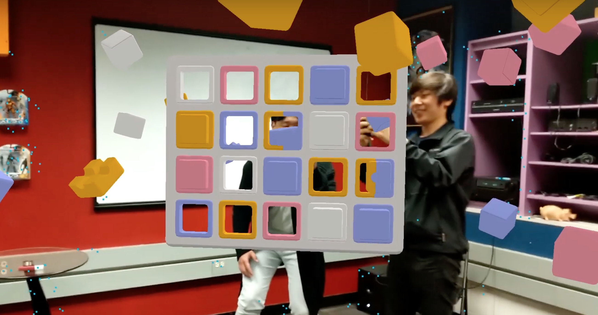

# Love-Brick
Brick is a collaborative game in which two players work together to fill in a pattern of empty slots in a grid, using virtual blocks that are scattered all over the room. This project has been accepted in [CHI 2019](https://dl.acm.org/citation.cfm?id=3300553&fbclid=IwAR0brv_8-N9JoedsmPvJkXfrJV4bZqAh7JVJZw_VpeP68buUxZBt69cihW4).

_Previous work can be found in [love](https://github.com/trie94/love)._

## [Demo Video](https://www.youtube.com/watch?v=6DIVVlTO9Uw)

## Built With
* [Unity 2018.2.8f1](https://unity3d.com/get-unity/download/archive)
* [Google AR Core](https://developers.google.com/ar/)
* [Google Cloud Anchor](https://developers.google.com/ar/develop/java/cloud-anchors/overview-android)

## Prerequisites
* AR Core Supported Devices
* AR Core SDK for Unity

## Author
*Yein Jo*

## License
This project is from a small group study in HCII and ETC at CMU and licensed under the CMU students: Po Bhattacharya, Ketki Jadhav, Radha Nath, Yein Jo; Jessica Hammer as an instructor.
